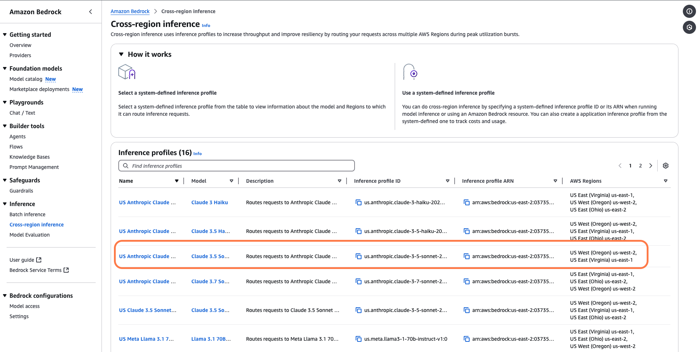
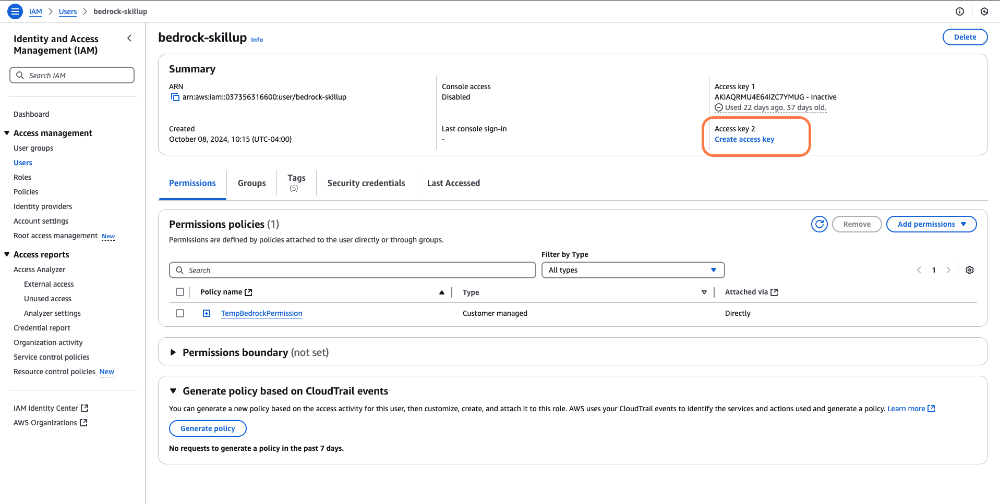
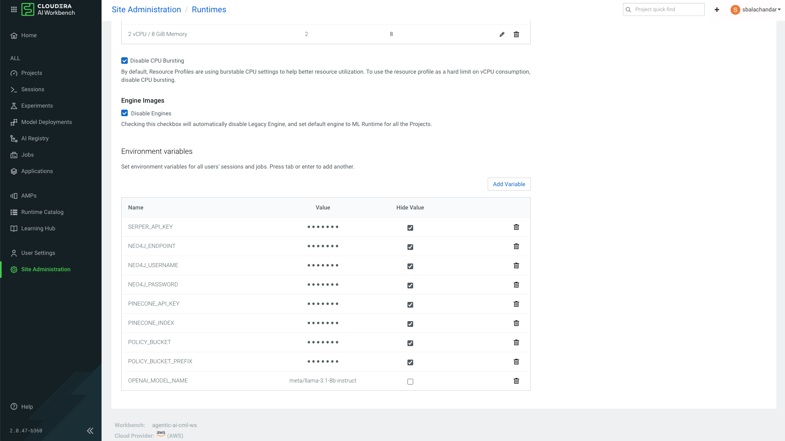

## Amazon Bedrock Setup

### Step 1: Enable Model Access

Go to Amazon Bedrock in the region your environment is deployed. See what models are available. Check out the Cross-region Inference tab to see if your org already has access to some models. If you need to, go request access to a model.



### Step 2: Create an IAM Role with Bedrock Permissions

Go to AWS IAM and create a new IAM role. You can name it whatever you want. Make sure to attach the following IAM policy to it:

```
{
    "Version": "2012-10-17",
    "Statement": [
        {
            "Sid": "BedrockAll",
            "Effect": "Allow",
            "Action": [
                "bedrock:*"
            ],
            "Resource": "*"
        },
        {
            "Sid": "DescribeKey",
            "Effect": "Allow",
            "Action": [
                "kms:DescribeKey"
            ],
            "Resource": "arn:*:kms:*:::*"
        },
        {
            "Sid": "APIsWithAllResourceAccess",
            "Effect": "Allow",
            "Action": [
                "iam:ListRoles",
                "ec2:DescribeVpcs",
                "ec2:DescribeSubnets",
                "ec2:DescribeSecurityGroups"
            ],
            "Resource": "*"
        },
        {
            "Sid": "PassRoleToBedrock",
            "Effect": "Allow",
            "Action": [
                "iam:PassRole"
            ],
            "Resource": "arn:aws:iam::*:role/*AmazonBedrock*",
            "Condition": {
                "StringEquals": {
                    "iam:PassedToService": [
                        "bedrock.amazonaws.com"
                    ]
                }
            }
        }
    ]
}
```

From the UI, make sure to obtain an Access Key and Secret Key. Note: 


There are approaches where you can instead attach a role to your Liftie cluster. That is out of scope for this document.

### Step 3: Enter IAM Credentials into Cloudera AI Workbench

You can set these at the project level or at the workbench level. For HOLs, it is recommended to set it at the workbench level so that participants don't need to enter or access them on their end.

