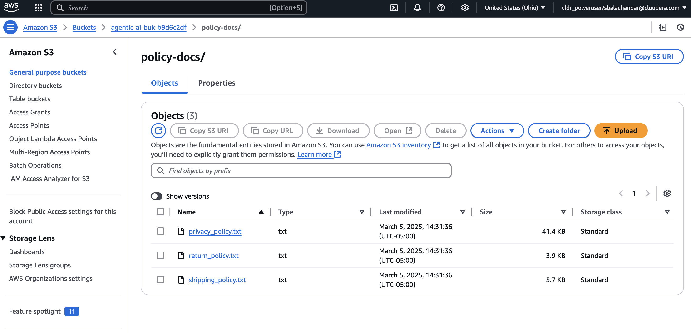
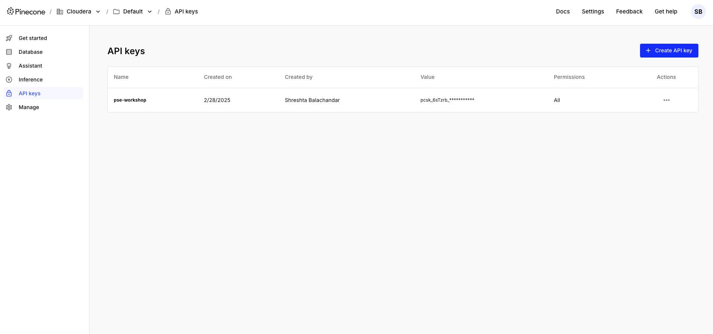
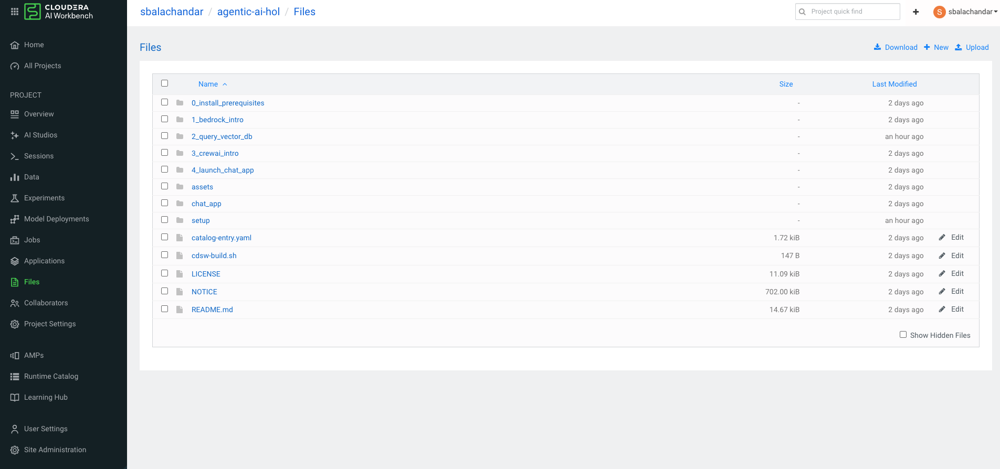

## Pinecone Setup

### Step 1: Upload Policy Documents to AWS S3

Go to the S3 bucket created for your Cloudera environment. Then go create a folder/prefix. In the screenshot below, we have set it as _"policy_docs/"_.

Upload the policy files from the _"policy_documents"_ directory to the S3 bucket and prefix you have created as shown below.



### Step 2: Set S3 and Pinecone Env Variables in Cloudera AI

First, go to Pinecone and get an API Key.



Within Cloudera AI, make sure to set the following environment variables:
```
# Policy Documents Setup
POLICY_BUCKET # This is your datalake S3 Bucket
POLICY_BUCKET_PREFIX # The S3 prefix you used in Step 1

PINECONE_API_KEY # API Key you obtained
PINECONE_INDEX # Choose a name for a Pinecone Index you want to set
```

### Step 3: Launch the HOL as a Project in your workbench

Make sure to create a new project with all the code from the HOL in your workbench. If you installed as an AMP, ensure that the setup steps are completed or the required dependencies are installed.



### Step 4: Run the Pinecone Embeddings Creation Python File

Start a Cloudera AI session within your project. Copy the `create_pinecone_embed.py` file from this folder and upload it to your workbench. You can alternatively copy the code to a fresh python file on your end.

Then, run the Python file using the terminal. We have a sample command below:

`python3 create_pinecone_embed.py`

The code in the file converts the policy files you uploaded earlier to S3 into embeddings and then upserts them into Pinecone. You should now be able to interact with Module 2 of the lab.