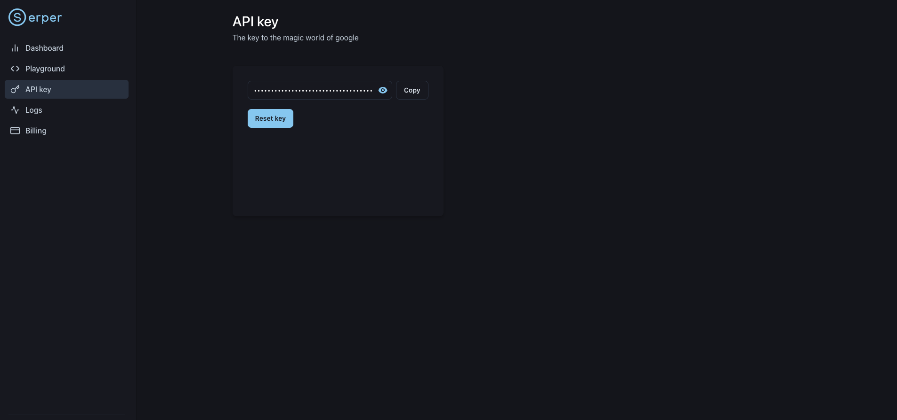

# Setup Guide for the AI Agents with Partners HOL

### Key Links:
- [GitHub Repo](https://github.com/cloudera/cloudera-partners/tree/feature/ai-agents-hol-cai)
- [SKO Deck](https://docs.google.com/presentation/d/1_-HRgb4PiycIPvH6YiAETImpGhvSE9bjEHCKwfZxE6Y/edit#slide=id.g32053a21050_0_0)

### Prerequisites
- Cloudera on Cloud Environment (Setup has only been tested with AWS)
- AI Inference Service Model Endpoint in the same Environment
    - Note: We have tested with Llama 3.1 8B but any other OpenAI API-compatible LLM with 8B or higher number of parameters should work
    - Additionally, make sure to set the Knox Token Kerberos - TTL in the datalake to at least 1 or 2 days so that participants don't run into errors when their token times out during the lab

### Environment Variables to set in the Site Administration

```
# AWS Bedrock
AWS_ACCESS_KEY_ID
AWS_SECRET_ACCESS_KEY
AWS_DEFAULT_REGION # Must be the region where the Bedrock models for Modules 1 and 4 are available
AWS_BEDROCK_MODEL # This is the model you plan to use for Modules 2 and 4

# Note: You can alternatively use a model deployed via the AI Inference Service, but you will need to handle the code changes required

# Policy Documents Setup(Currently using policy documents from local file system)
#POLICY_BUCKET # This is your datalake S3 Bucket
#POLICY_BUCKET_PREFIX # The S3 prefix where you load the policy documents

PINECONE_API_KEY # API Key to interract with Pinecone
PINECONE_INDEX # Index where the policy document embeddings will be stored

# Neo4j Setup
NEO4J_ENDPOINT # Endpoint provided by Neo4j Aura (or other form factor)
NEO4J_USERNAME # Neo4j Username
NEO4J_PASSWORD # Neo4j Password

# Cloudera AI Inference Service Setup
OPENAI_BASE_URL # Base URL Provided but need to cut the "/chat/completions" suffix
OPENAI_MODEL_ID # Model name is parameterized now. Pending testing

# Serper Setup
SERPER_API_KEY # Obtain from the Serper website
```

## Lab Setup

This repo contains the steps required to setup the lab with all the credentials noted above. There are 3 main modules shown below.
  - [1. Setup Amazon Bedrock](1_bedrock_setup/README.md)
  - [2. Setup Pinecone](2_pinecone_setup/README.md)
  - [3. Setup Neo4j](3_neo4j_setup/README.md)
  - [4. Create Participant AMPs](4_participant_amps/README.md)

For configuring the credentials for the Cloudera AI Inference Service and Serper, follow the instructions below.


### AI Inference Configuration

Go to the deployed AI Inference Model and obtain the Base URL and Model name. Set them as the Environment Variables noted above.

You can follow the instructions [here](https://community.cloudera.com/t5/Community-Articles/Fully-Private-Agents-with-Cloudera-s-AI-Inference-Service/ta-p/400799) for more information.

### Serper Configuration

- Go to the Serper website and sign up for a free account
- You will be granted up to 2,500 credits (as of 3/3/25). Then go to the API Key page and copy the API key provided
    - Note: The quantity of credits is generally sufficient for 10 workshops, assuming around 100 users per workshop
- Enter the API Key as an environment variable in Cloudera AI



## Successful Lab Tips

1. Make sure to provision the required GPU for AI Inference at least 1 day in advance so that you are not stuck with GPU availability issues during autoscaling.
2. Make sure to provision enough CPU worker nodes for the workspace and scale it up a couple of hours before the lab so that participants don't have latency issues.
3. Test out the lab as a participant. Login via Keycloak, go through all the steps and ensure that lab users have the required access.

**IMPORTATNT** 

You need to check the AWS limits (Service Quota Dashabord) for the resource types you will be using. This includes total number of instances of each type that your AWS account is allowed to deploy in a given region, as well as quotas like _Running On-Demand G and VT instances_ that govern the total number of CPUs of a given instance type you can deploy at once.

## Teardown

Make sure to diligently complete the following steps:
1. Immediately delete or suspend the Cloudera AI workbench
2. Reset the Serper API Key via their website
3. Reset the Pinecone API Key via their website
4. Deactivate and delete the AWS Access Key for the IAM User created
5. Shut down the AI Inference Endpoint - Delete the model endpoint, inference service and compute cluster
6. If re-using a common Keycloak server, modify the network rules as needed to cutoff access.
7. For Neo4j, … (TBC)
8. Delete the Cloudera AI workbench and shut down the Cloudera environment
