= Project Axon: Bank Branch Performance Analytics
:author: Yash Gulati
:revdate: 2025-06-20
:toc:
:toclevels: 2

== Introduction

*Project Axon* is a comprehensive end-to-end demonstration of Cloudera’s capabilities across the full data lifecycle — from data ingestion to dashboarding. 

The goal of this project is to help partners:
- Understand how to practically use Cloudera Private Cloud for real-time and batch analytics.
- Identify a relevant and easy-to-explain use case.
- Showcase a ready-to-deploy demo to customers after initial discovery conversations.

**Use Case Chosen:** *Bank Branch Performance Analytics*

This use case helps simulate and analyze the operational performance of various bank branches using dummy data, allowing visual insights via dashboards.

== Prerequisites

Before running the project, ensure the following components are installed:

=== On the Dummy Data Generator Host:
You can clone and run this dummy generator app on **any linux server** you have access to.  
Just make sure the following ports are open on the server firewall/security groups:  
**8000, 8085, 5001, 5003, 5400, 5500**
[source,shell]
----
sudo yum install -y python3
python3 -m ensurepip --upgrade
sudo yum install -y git
pip3 install Flask
pip3 install Faker
python3 -m flask --version
pip3 install uvicorn
pip3 install fastapi
----

=== Cloudera Platform Requirements:
You should have a **Cloudera Private Cloud Base cluster** running with the following services enabled:

- Apache NiFi  
- NiFi Registry  
- HDFS  
- Hue  
- Cloudera DataViz  
- Hive  
- Impala  
- Apache Knox

[NOTE]
====
Make sure an entry is added in your local machine’s `/etc/hosts` file pointing the **public IP** of the `pvcbase-master` (or the node where **Knox** is installed) to its **hostname**.  
This is required to access the Knox gateway and other web UIs from your browser.
====

This project was developed and tested on the following component versions:

- **Cloudera Manager**: 7.11.3-CHF11  
- **CDP Base Runtime (CDH parcel)**: 7.1.9 SP1 CHF4  
- **Java**: 17.0.15  
- **Cloudera Flow Management (CFM)**: 2.1.7.2002-3  
- **Apache NiFi**: 1.28.1  
- **Cloudera DataViz**: 8.0.4-b47.p1.67141340

== Technology Stack

- **Data Generator**: Python (Flask + Faker)
- **Data Ingestion**: Apache NiFi
- **Storage**: HDFS (Parquet format)
- **Data Query Layer**: Hive tables created via Hue
- **Visualization**: Cloudera DataViz

== Project Workflow

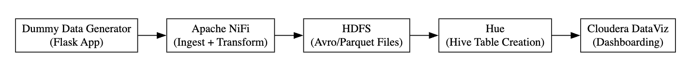

== Steps to Run

=== 1. Clone the Dummy Data Generator Repository

[source,shell]
----
git clone hhttps://github.com/cloudera/cloudera-partners/tree/project-axon
cd Project-Axon
./run_all.sh
----

- After running the script, verify that the dummy data endpoints are active using a curl command.
- Replace <your-server-ip> with the public IP of the node where you ran the script.
For example:
[source,shell]
curl http://<your-server-ip>:5400/footfall/summary
curl http://<your-server-ip>:8000/campaign-details

You should see a JSON response with dummy footfall data.

=== 2. Configuration on `NiFi Registry` UI

.. Login to the `NiFi Registry` UI.
.. Create a new bucket (for example, name it `Axon-Files`).
... Click on the wrench `🔧` icon on the top right corner to open settings.
+
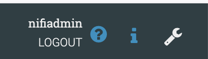
... Click on *New bucket* and name it `Axon-Flow`.
+
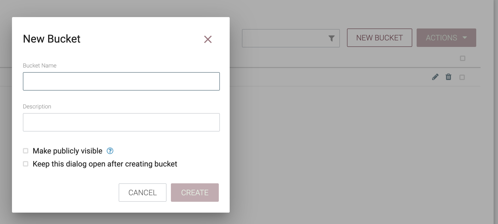

.. Upload the Project-Axon flow to the Registry:
... Click on the *Import New Flow* button at the top-right corner of the Registry UI.
+
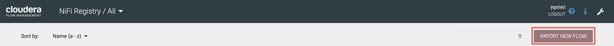
+
... Enter a name for the flow (e.g., `Project-Axon`).
... Select the `Axon-Flow` bucket.
... Upload the flow file https://github.com/cloudera/cloudera-partners/blob/project-axon/Project-Axon/Project-Axon.json[`Project-Axon.json`] and click **Import**.
+
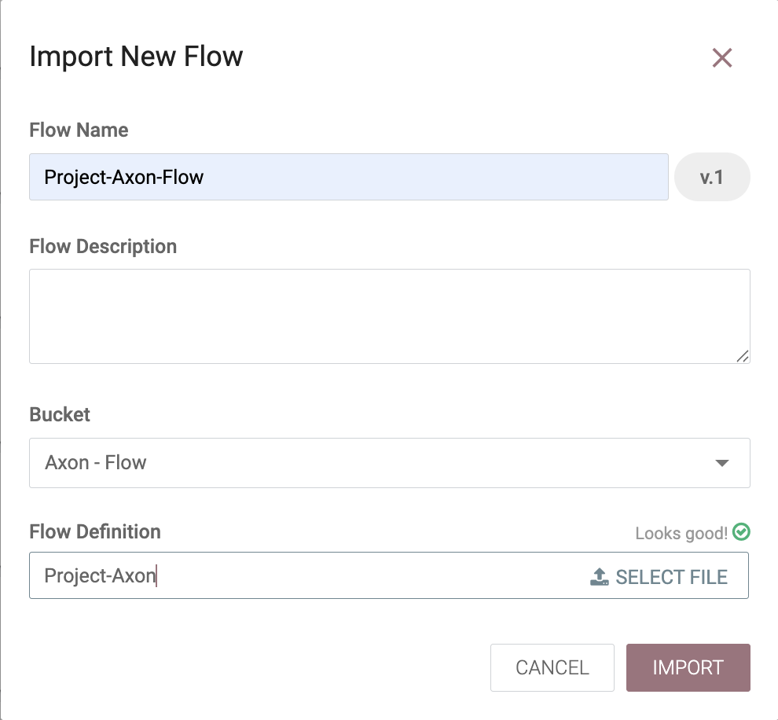

=== 3. Import the NiFi Flow into NiFi from Registry

- Go to NiFi UI.
- Drag a new **Process Group** onto the canvas.
- Give it any name (e.g., `Project-Axon`).
+
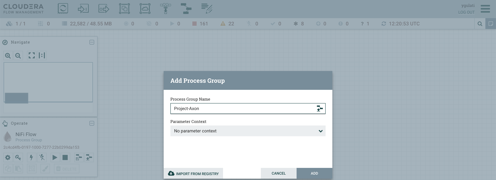
+
- After naming it, click **Import from Registry**.
- Select the `Axon-Flow` bucket, choose the `Project-Axon` flow and desired version, then click **Import**.
+
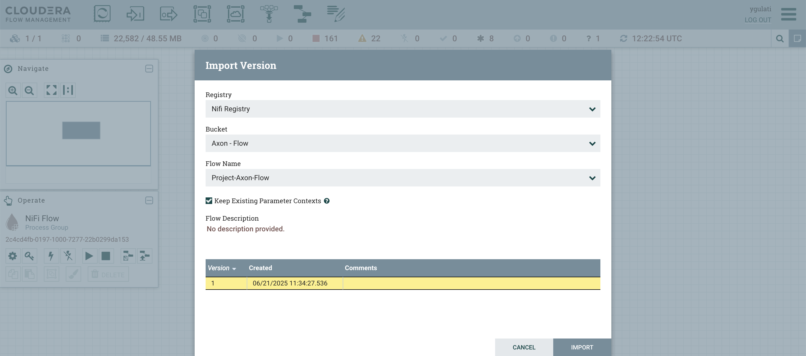

NOTE: After starting the flow, run it for a maximum of 5 minutes. It will generate approximately **50–80 flow files**.  
After that, right-click and click **Stop**, otherwise it will continue generating files indefinitely.

=== 4. Update the InvokeHTTP URLs in NiFi Flow

After importing the `Project-Axon` flow into NiFi and *before starting it*, you must update the `InvokeHTTP` processor URLs to point to the correct host where your dummy data generator app is running.

- Double-click the `Project-Axon` Process Group to open it. You'll see individual NiFi flows for different databases.
- Double-click to open each sub-flow.
- Locate the processor named *InvokeHTTP* (there is one per data source).
- Double-click the *InvokeHTTP* processor.
- In the *Properties* tab, find the *HTTP URL* field.
- Replace only the *<your-server-ip>* in the URL with the *Public IP address* of the server running your dummy generator app.  
  For example:  
  `http://<your-server-ip>:8000/campaign-details`
+
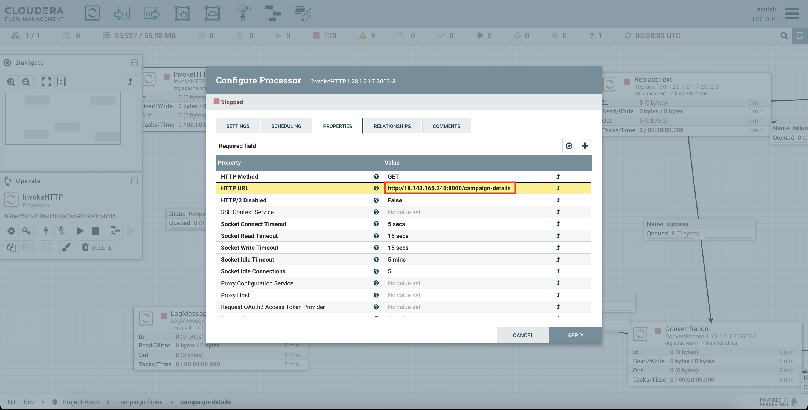
+
- *Repeat* this step for *each NiFi flow*.
- Click *Apply* to save changes.

=== 5. Configure Apache NiFi (HDFS Access)

To enable Hue and Hive to read files from HDFS, ensure NiFi has authenticated HDFS access using Kerberos.

==== Step 1: Locate the HDFS keytab file
[source,shell]
----
find / -name hdfs.keytab
----

==== Step 2: Verify keytab contents (optional)
[source,shell]
----
klist -kt /run/cloudera-scm-agent/process/1546343796-hdfs-NAMENODE/hdfs.keytab
----

==== Step 3: Authenticate with Kerberos
[source,shell]
----
kinit -kt /run/cloudera-scm-agent/process/1546343796-hdfs-NAMENODE/hdfs.keytab hdfs/pvcbasemaster.cldrsetup.local@CLDRSETUP.LOCAL
----

==== Step 4: Create HDFS target directory
[source,shell]
----
hdfs dfs -mkdir /Axon-Files
----

==== Step 5: Configure `PutHDFS` in NiFi

- Open the **PutHDFS** processor inside the process group.
- In the *Kerberos Credentials Service* field, click the arrow (`→`) to navigate to the controller service.
+
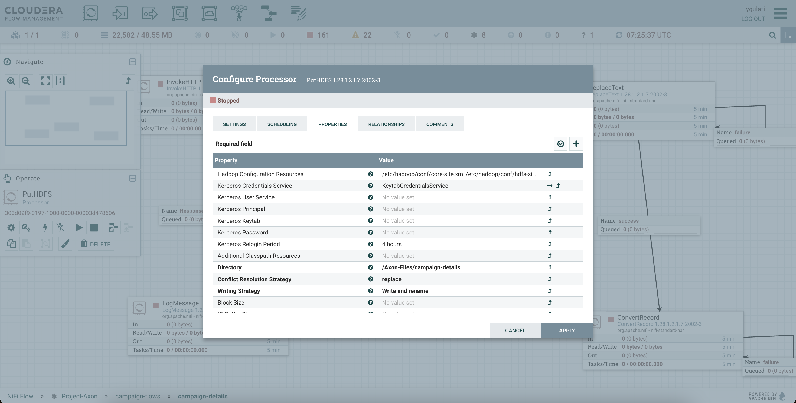
+
- Click the **gear icon** (⚙️) to open the settings configuration.
- In the settings configuration, provide: **Kerberos Principal** and **Kerberos Keytab** file path.
+
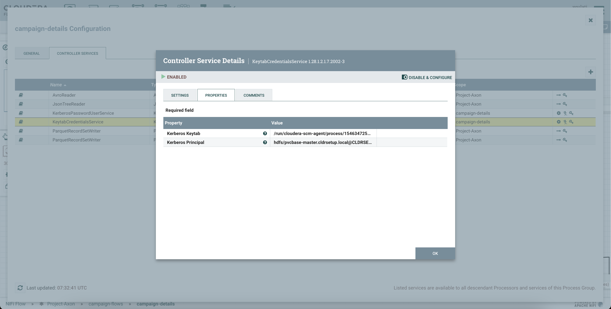
+
- Save and enable the controller service.

==== Step 6: Start the `Project-Axon` NiFi Flow
- Inside the process group, right-click and select **Start**.
+
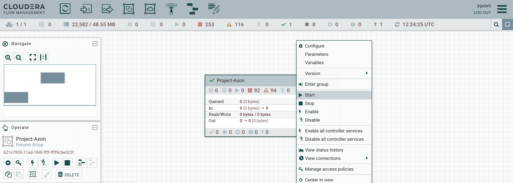

=== 6. Create Hive Tables via Hue

Go to **Hue → Query Editor → Hive**.

To create all the required databases and tables at once, simply:

- Open the https://github.com/cloudera/cloudera-partners/blob/project-axon/Project-Axon/create_queries.txt[create_queries.txt] file from the cloned folder.
- Copy the entire content.
- Paste it into the Hue Query Editor.
- Select all and click the **Run** button.
+
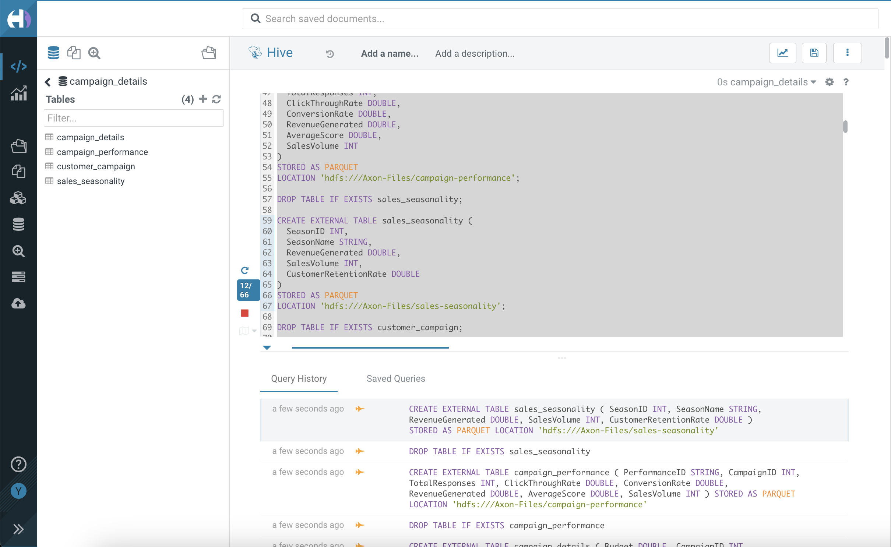

This will create all the necessary Hive tables and databases for the project in one go.

=== 7. Connect DataViz to Hive

To enable DataViz to read data from Hive, you need to create a connection:

- Go to *Cloudera DataViz* and navigate to the *Data* tab.
- Click *+ New Connection* → *Hive / Impala*.
+
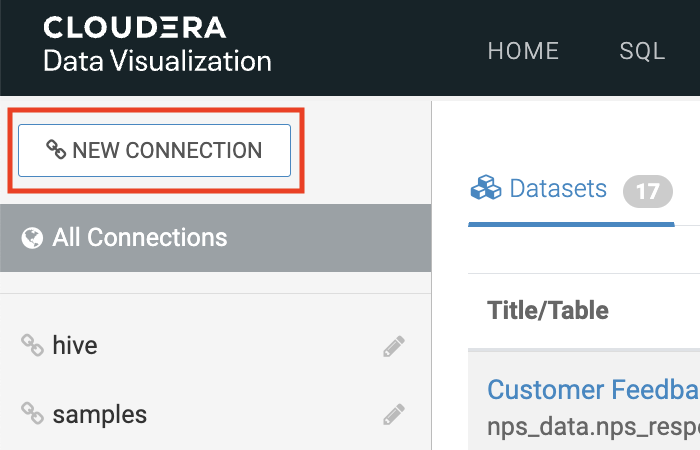
+
[width="90%",cols="40%,50%",options="header"]
|===
|**Parameter** |**Value**
|*Connection Name* |Hive-Axon (or any name you prefer)
|*Connection type* |Hive
|*Hostname* |pvcbasemaster.cldrsetup.local (or your HiveServer2 host)
|*Port* |10000 (for Hive) or 21050 (if using Impala)
|*Kerberos Credentials* |Use your admin username and password

2+|*Advanced Tab Settings*

|*Connection Mode* |Binary
|*Authentication Mode* |Kerberos
|*Kerberos Service Name* |Enter any name (e.g., `hive`)
|===
+
- Click *Test Connection* to verify.
+
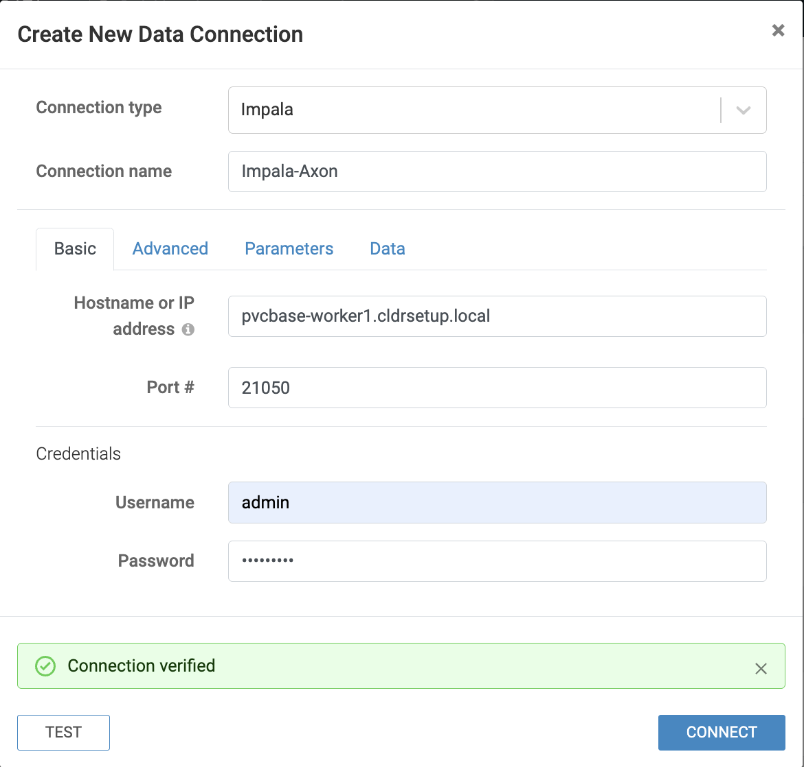
+
- Once successful, click *Save*.
- You can now use this connection to create/import datasets and build/import dashboards from Hive tables.

=== 8. Add Ranger Policy for DataViz Access

Before importing the dashboard into Cloudera DataViz, you must ensure the `dataviz` user has access to the Hive databases and tables. This is done by updating an existing policy in Apache Ranger.

- Log in to the *Ranger Admin UI* using admin credentials.
- Select the service named *Hadoop SQL*.
- Locate the policy named `9 all - database, table, column`.
- Click on the *Edit* icon to open it.
+
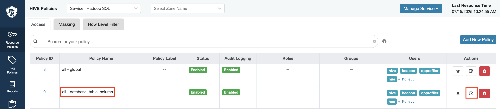
+
- In the *Users* section, add `dataviz` to the list.
- Scroll down and click *Save*.

=== 9. Import Dashboard into DataViz

- Go to Cloudera DataViz → *Data* tab → *Import visual artifacts*.
+
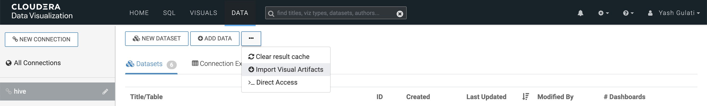
+
- Upload the dashboard JSON file: https://github.com/cloudera/cloudera-partners/blob/project-axon/Project-Axon/project_axon_dashboard.json[project_axon_dashboard.json].
- Once imported, navigate to the *Visuals* tab and click on the dashboard to open and view it.
+
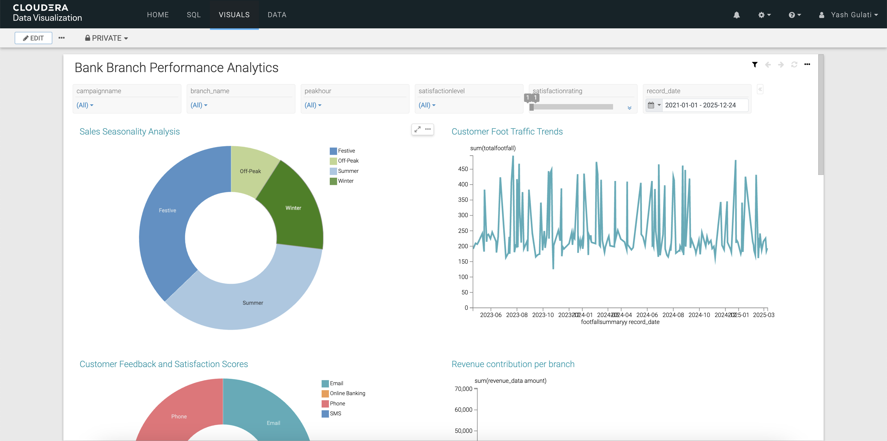

== Contact

For questions, feedback, or demo support, please reach out to the **Partner Solutions Engineering** team at Cloudera.
