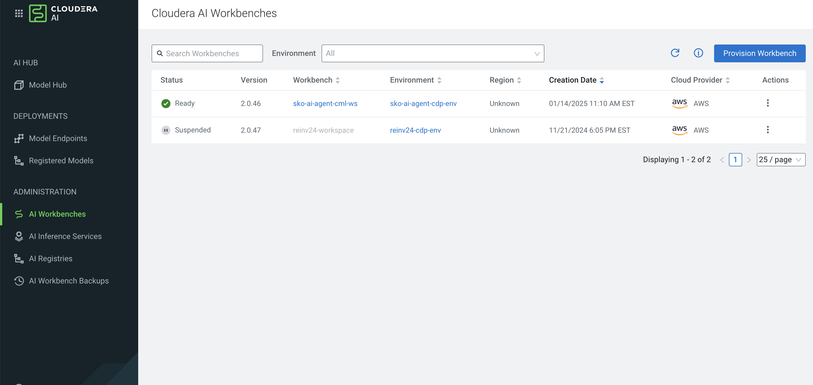
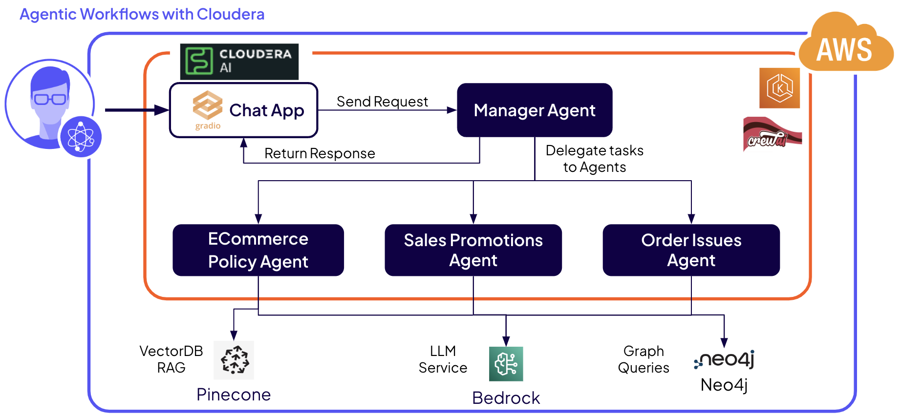
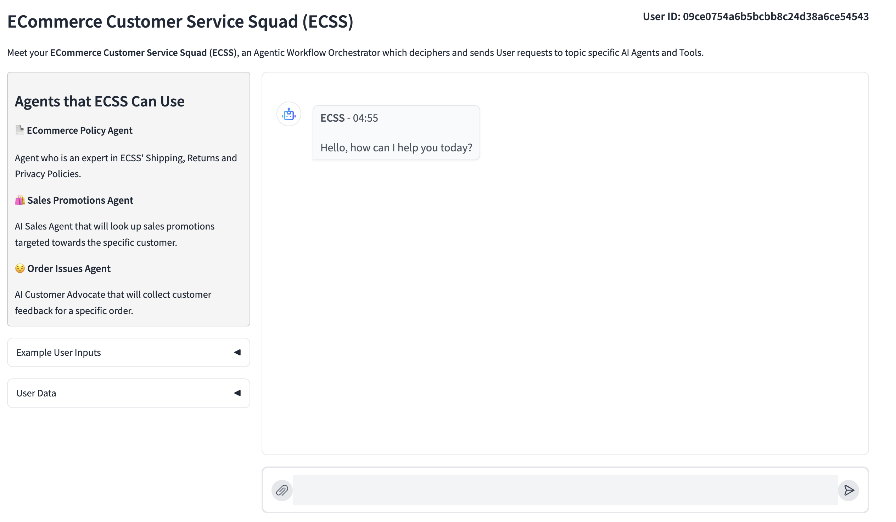

# AI Agents with Cloudera AI

The goal of this hands-on-lab is to explore Cloudera AI and how it can be used to build AI Agents and Agentic [Retreival Augmented Generation](https://arxiv.org/abs/2312.10997) (RAG) applications. Starting with a low-code approach with Cloudera AI's Agent Studio and finishing with a complete chatbot application, participants will get to know some of the key Cloudera AI features and advantages. In a real-world scenario, changing business requirements and technology advancements requires agility and Cloudera AI is a great tool to enable Data Science practitioners to build use cases quickly.

## Lab Flow

In this lab, you will start by building your own agents first. Next, you will interact with a multi-agent workflow that talks to a Pinecone vector database and a Neo4j Graph Database as part of an E-Commerce Chat application

There are currently 3 exercises in the lab. It is important to follow the exercise order. 
  - [0. Getting into Cloudera AI](#module-0-getting-into-cloudera-ai)
  - [1. Single Agent Workflow](./docs/Agent%20Studio%20HOL%20-%20Participant%20Guide%20-%204-24%20External%20Lab.pdf)
  - [2. Sequential Agent Workflow](./docs/Agent%20Studio%20HOL%20-%20Participant%20Guide%20-%204-24%20External%20Lab.pdf)
  - [3. Deploy a Agentic Chat application](#module-3-deploy-a-cloudera-ai-application)

## Module 0: Getting into Cloudera AI

After login, you will be taken to the home screen of Cloudera Data Platform. Some of you may be asked to "Try the new UI...". Make sure to click **Enable New UI**. From here you can access Cloudera AI - one of its Data Services.

> **0a.** Click on the "Cloudera AI" icon.


> **0b.** Then click on ML Workspace provided to you by your facilitator. Alternatively, you can directly use the workspace link assigned to you.


If you are new to Cloudera AI, take a moment to explore the dashboard.

Cloudera uses the concept of _projects_ to organize the workspace. Each project is typically linked to a remote repository (e.g. git) and can have multiple collaborators working on it.

## Modules 2 & 3 Build Agents using Cloudera Agent Studio

Go to the PDF provided for Modules 1 and 2 [here](./docs/Agent%20Studio%20HOL%20-%20Participant%20Guide%20-%204-24%20External%20Lab.pdf)

## Module 3: Deploy a Cloudera AI application

> **Lab use case:** An ECommerce vendor is looking to pilot a LLM based chat to answer customer questions related to company policies and promotions. 

In the interest of time, a _Hands on Lab with RAG Agents_ project has already been created for you and you are the sole _Owner_ of that project.

When ready click into the project:


Take a moment to familiarize yourself with the project page. Notice that your project now has all required files (your code base), a readme below, project specific options in the left hand column, plus more. Throughout the lab you will use many of the features listed here.


So far we have interacted with our models and vector database through a Jupyter notebook. Now lets see how a user might interact with an LLM solution through a Cloudera AI application. Cloudera AI can be used to deploy UI applications based on popular frameworks (e.g. [flask](https://flask.palletsprojects.com/en/3.0.x/), [streamlit](https://streamlit.io/), [gradio](https://www.gradio.app/)) for deploying applications. In this lab we'll be deploying a gradio app to interact with the model using a chat interface. 

The exercise will walk you through the steps to deploy the application using the UI. We'll also explore how to do this programatically through the Cloudera AI APIv2. Below, you can see how we have multiple AI Agents working together within Cloudera AI and how they interact with external AWS and non-AWS services.

**Agentic Workflow Architecture**


>**4a.** Go to your project screen. 

>**4b.** In the left sidebar click on _Applications_. 


>**4c.** Press _New Application_ in the middle of the screen.

>**4d.** Name your application. Here we name it ```Agentic AI Chat App```

>**4e.** Provide a creative subdomain name. This has to be **unique**.

>**4f.** Select the following path for your application **Script**:
```chat_app/agents_app_launch.py```

>**4g.** Ensure you have selected the right container settings for the application, per below:
>* For **Editor** select _JupyterLab_ 
>* For **Kernel** select _Python 3.10_
>* For **Version** select _2024.10_
>* For **Edition** select _Standard_ 

>**4h.** For resource profile, select _2 vCPU / 4 GB Memory_. Overall, aside for the subdomain, settings should look like the below screenshot.


>**4i.** Click _Create Application_ at the bottom of the page.

### Interacting with an Application
The application will take a couple of miuntes to start, once it does you can click on its card to open the UI. While it's starting you can review the code in the ```chat_app``` directory.

You will notice that we have folders for ```crew_agents``` and ```tools```, where we define the agents and tools for the application. The ```chat_utils``` folder is used to host utility functions that make it easier to interact with Pinecone and Neo4j. We store the application's global state using the ```app_config``` folder. You will notice the reliance on some environment variables. These have been setup at the ML Workspace level and can be shared accross all projects. Alternatively, environment variables can be specific to a Project or even a session, job, or application.

>**4j.** Check to confirm your app has deployed successfuly. You should see a message confirming this. 


>**4k.** Click on the App's URL to navigate to the Gradio UI. In a new tab you should see the appliction open:


Take some time to ask different questions about CML. Some examples to get you started... 
- How fast can you ship purchases?
- Who can I contact if I want to delete my private data?
- Am I eligible for any promos currently?
- Hi I didn't receive my order

Note that the privacy question's response is based on the policy document loaded into the Pinecone Vector DB. The promos question is served using Neo4j Graph DB. Both are RAG-based techniques. Detailed esplaination of how the promos feature has been prepared in in the section below. 

:pencil2: One of the key capabilities of Cloudera AI is the hosting Applications integrated as part of the Data Science workflow. Practitioners can iterate rapidly and securely share insights, features, and prototypes to interested stakeholders. 


### Implementing a Rewards System with Neo4j GraphDB

### 1. Creating Rewards Tiers:
   To enhance our customer loyalty program, we start by defining different rewards tiers based on specific benefits. This helps us categorize customers and provide tailored incentives.

The Cypher queries create four distinct rewards tiers:

- Diamond Tier: Offers free shipping on all orders and a free lifetime warranty on applicable products.
- Gold Tier: Provides free shipping on orders over $100 and a discounted warranty on applicable products.
- Silver Tier: Ensures free shipping on orders over $200.
- Member Tier: Standard tier without additional perks.
   
By setting up these tiers, we can effectively differentiate the benefits and create a structured rewards program.

### 2. Calculating Reward Mapping Variables:  
   Next, we need to determine the criteria for assigning customers to these tiers. We calculate key variables like the average purchase amount and the standard deviation of purchase amounts.

- Order Aggregation: We match orders and sum the prices of the items to get the purchase amounts.
- Statistics Calculation:  We then calculate the average and standard deviation of these purchase amounts to create a benchmark.

These metrics are stored in a node called **lifetime_rewards_variable**, providing a reference for mapping customers to appropriate rewards tiers based on their spending behavior.

### 3. Creating a Sample of Customers: 
   For demonstration purposes, we generate a random sample of 50 customers to showcase how they can be mapped to our rewards tiers.

- Random Sampling: We select a random subset of customers.
- Data Structuring: We create **sample_customer** nodes and establish relationships between these customers and their orders.

This sample allows us to visualize the distribution of customers across different tiers and evaluate the effectiveness of our rewards system.

Through these steps, we establish a comprehensive rewards program that not only incentivizes customer loyalty but also provides a clear framework for tier-based benefits. By leveraging Neo4j's graph database capabilities, we gain valuable insights into customer behavior and ensure targeted, effective rewards distribution.


You've learned a lot in the last few hours, but this is just the beginning. [Cloudera AI ](https://www.cloudera.com/products/machine-learning.html) has a lot more to offer for your enterprise as part of an overall [Cloudera](https://www.cloudera.com/) on-prem and in the cloud. 


### CrewAI Chat App Architecture

**Interface**
Interface The chat interface is built using
- Gradio for UI
- CrewAI for agentic workflow orchestration
- AWS Bedrock for all the LLMs
   - Default: anthropic.claude-3-sonnet-3.5

**Under the Hood**
To build the application responses to User requests, we use CrewAI, a framework which helps to organize and launch agentic workflows. The CrewAI libraries give us a convenient way to describe all the critical parts of the application:

**The Manager Agent** 
- Coordinates all the communications between agents
- Routes the relevant messages to other purpose built agents
- Ensures a high quality of response from the agents. 
   - Reviews the quality of results from the agents. 
   - (Note : Does the QA)

**Policy Agent**
- Customer service agent expert in policies 
- Queries the Policy document from the Vector DB
- Provides a summarized response to the master agent 

**Promotional Agent RTO**
- Takes customer reference(ID)
- Queries the graph DB(Neo4j) to get the rewards  tier and the associated promotions. _As part of implementation the GraphDB engine calculates standard deviations from the average purchase amount and puts the customer into tiers: Diamond, Gold and Basic._

**Order Issues Agent**
- Collects feedback from the customer about any Order Issues
- Submits the feedback to a Neo4j Graph DB
